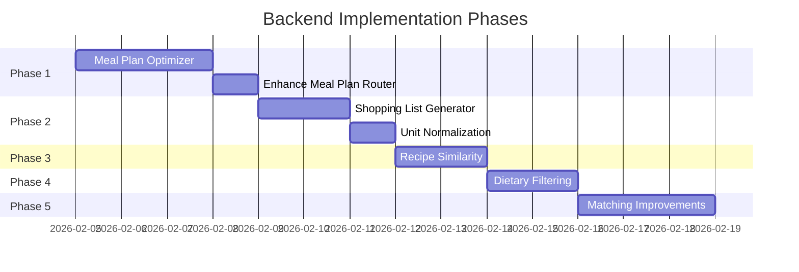

# Backend-Frontend Integration Plan

## Overview

This plan documents the backend work needed to fully support the React frontend meal planning application. The frontend is complete and expects certain API behaviors that are partially implemented.

## Current State Analysis

### Frontend Expects (from `frontend/src/api/endpoints.ts`)

| Endpoint | Method | Status | Notes |
|----------|--------|--------|-------|
| `/api/v1/meal-plans/` | POST | Partial | Creates plan but recipe selection needs improvement |
| `/api/v1/meal-plans/` | GET | Done | List user's plans |
| `/api/v1/meal-plans/{id}` | GET | Done | Get specific plan |
| `/api/v1/meal-plans/{id}` | PATCH | Done | Update plan |
| `/api/v1/meal-plans/{id}` | DELETE | Done | Delete plan |
| `/api/v1/meal-plans/{id}/shopping-list` | GET | Partial | Basic aggregation, needs product matching |
| `/api/v1/recipes` | GET | Done | Search recipes (Neo4j) |
| `/api/v1/recipes/{id}` | GET | Done | Get recipe details |
| `/api/v1/recipes/{id}/cost` | GET | Partial | Depends on product matching quality |
| `/api/v1/recipes/by-discounts` | GET | Done | Find discount-optimized recipes |
| `/api/v1/stores/discover` | GET | Done | Store discovery |
| `/api/v1/categories` | GET | Done | List categories |
| `/api/v1/areas` | GET | Done | List cuisines |

### Backend Gaps

1. **Meal Plan Generation** - Currently selects recipes randomly from discount pool
2. **Cost Estimation** - Requires good ingredient-to-product matching
3. **Shopping List** - Basic aggregation exists but product matching is weak
4. **Recipe Replacement** - No endpoint for "find similar recipes"

---

## Implementation Tasks

### Phase 1: Meal Plan Optimization (Priority: High)

**Goal**: Generate intelligent meal plans that minimize cost while respecting preferences.

#### Task 1.1: Create Meal Plan Optimizer

**File**: `src/foodplanner/plan/optimizer.py`

```python
class MealPlanOptimizer:
    """
    Optimizes meal plan selection based on:
    - Discount availability (prioritize discounted ingredients)
    - Dietary preferences (filter by restrictions)
    - Ingredient reuse (minimize waste)
    - Budget constraints
    """

    async def optimize(
        self,
        days: int,
        people_count: int,
        store_ids: list[str],
        dietary_preferences: list[DietaryPreference],
        budget_max: float | None = None,
    ) -> list[RecipeSelection]:
        pass
```

**Implementation Steps**:
1. Fetch all recipes from Neo4j with their ingredients
2. Score each recipe based on:
   - Number of discounted ingredients (higher = better)
   - Estimated cost per serving
   - Match with dietary preferences
3. Use greedy algorithm to select recipes that maximize discount usage while minimizing ingredient variety (reuse)
4. Apply budget constraint as hard filter

**Dependencies**:
- `GraphService.find_recipes_with_discounts()` (exists)
- `GraphService.estimate_recipe_cost()` (exists)
- Need new: `GraphService.get_recipe_ingredients_with_products()`

#### Task 1.2: Enhance Meal Plan Router

**File**: `src/foodplanner/routers/meal_plans.py`

Update `create_meal_plan()` endpoint to:
1. Use `MealPlanOptimizer` instead of simple recipe selection
2. Return cost estimates for each recipe
3. Include "why suggested" metadata (e.g., "uses 3 discounted ingredients")

---

### Phase 2: Shopping List Enhancement (Priority: High)

**Goal**: Generate accurate, store-specific shopping lists.

#### Task 2.1: Improve Ingredient Aggregation

**File**: `src/foodplanner/plan/shopping_list.py`

```python
class ShoppingListGenerator:
    """
    Generates shopping lists from meal plans with:
    - Quantity aggregation across recipes
    - Unit normalization (e.g., 2 cups + 500ml -> 1L)
    - Product matching with confidence scores
    - Store-specific pricing
    """

    async def generate(
        self,
        plan: MealPlan,
        store_ids: list[str],
    ) -> ShoppingList:
        pass
```

**Implementation Steps**:
1. Extract all ingredients from plan recipes
2. Normalize quantities to standard units
3. Aggregate same ingredients (e.g., "2 onions" + "1 onion" = "3 onions")
4. Match aggregated ingredients to products
5. Select cheapest product per ingredient (prefer discounted)
6. Group by store and category

#### Task 2.2: Unit Normalization

**File**: `src/foodplanner/normalize/units.py`

```python
UNIT_CONVERSIONS = {
    # Volume
    "ml": 1,
    "l": 1000,
    "cup": 237,
    "tbsp": 15,
    "tsp": 5,
    # Weight
    "g": 1,
    "kg": 1000,
    "oz": 28.35,
    "lb": 453.6,
}

def normalize_quantity(quantity: str, unit: str) -> tuple[float, str]:
    """Convert to base units (ml for volume, g for weight)."""
    pass
```

---

### Phase 3: Recipe Replacement (Priority: Medium)

**Goal**: Allow users to swap recipes with smart alternatives.

#### Task 3.1: Recipe Similarity Endpoint

**File**: `src/foodplanner/routers/recipes.py`

Add endpoint:
```
GET /api/v1/recipes/{id}/similar
    ?criteria=cheaper|healthier|different
    &limit=5
```

**Implementation Steps**:
1. "cheaper": Same category, lower estimated cost
2. "healthier": Same category, better nutrition score
3. "different": Different category, similar prep time

#### Task 3.2: Graph Similarity Query

**File**: `src/foodplanner/graph/repository.py`

Add Cypher query:
```cypher
// Find recipes with overlapping ingredients (ingredient reuse)
MATCH (r1:Recipe {id: $recipe_id})-[:CONTAINS]->(i:Ingredient)
MATCH (r2:Recipe)-[:CONTAINS]->(i)
WHERE r1 <> r2
WITH r2, count(i) as shared
ORDER BY shared DESC
LIMIT $limit
RETURN r2
```

---

### Phase 4: Dietary Preference Filtering (Priority: Medium)

**Goal**: Properly filter recipes by dietary restrictions.

#### Task 4.1: Recipe Tagging

The MealDB data includes some tags, but we need to:
1. Parse existing tags for dietary info
2. Infer restrictions from ingredients (e.g., contains "chicken" -> not vegetarian)

**File**: `src/foodplanner/normalize/dietary.py`

```python
MEAT_INGREDIENTS = {"chicken", "beef", "pork", "lamb", "fish", ...}
DAIRY_INGREDIENTS = {"milk", "cheese", "butter", "cream", ...}
GLUTEN_INGREDIENTS = {"flour", "bread", "pasta", ...}

def infer_dietary_tags(ingredients: list[str]) -> list[str]:
    """Infer dietary tags from ingredient list."""
    tags = []
    ing_set = {i.lower() for i in ingredients}

    if not ing_set & MEAT_INGREDIENTS:
        tags.append("vegetarian")
    if not ing_set & (MEAT_INGREDIENTS | DAIRY_INGREDIENTS):
        tags.append("vegan")
    # etc.

    return tags
```

#### Task 4.2: Update Graph Import

When importing recipes from MealDB, compute and store dietary tags:
```python
recipe.tags = meal.tags + infer_dietary_tags(meal.ingredients)
```

---

### Phase 5: Cost Estimation Accuracy (Priority: Medium)

**Goal**: Improve ingredient-to-product matching for better cost estimates.

#### Task 5.1: Enhance Matching Algorithm

**File**: `src/foodplanner/graph/matching.py`

Current matching uses fuzzy string matching. Improve with:
1. **Synonym dictionary**: "capsicum" = "bell pepper" = "paprika"
2. **Danish translations**: "chicken" = "kylling", "onion" = "løg"
3. **Category hints**: If ingredient is "chicken breast", prefer products in "Kød" category

#### Task 5.2: Manual Match Overrides

Add admin endpoint to manually link ingredients to products:
```
POST /api/v1/admin/ingredient-matches
{
  "ingredient_name": "chicken breast",
  "product_id": "rema-123",
  "confidence": 1.0
}
```

---

## Database Changes

### New Models (if needed)

None required - existing models sufficient.

### Graph Schema Updates

Add computed properties to Recipe nodes:
- `dietary_tags: list[str]`
- `total_ingredients: int`
- `avg_cost_estimate: float` (updated periodically)

---

## API Response Enhancements

### MealPlanResponse

Add fields to `RecipeInPlan`:
```python
class RecipeInPlan(BaseModel):
    # ... existing fields ...
    suggestion_reason: str | None = None  # "Uses 3 discounted ingredients"
    discount_ingredients: list[str] = []  # ["chicken", "tomatoes"]
```

### ShoppingListResponse

Add fields to `ShoppingListItem`:
```python
class ShoppingListItem(BaseModel):
    # ... existing fields ...
    confidence_score: float | None = None  # Match confidence
    alternatives: list[str] = []  # Alternative product IDs
```

---

## Testing Strategy

### Unit Tests

1. `test_optimizer.py` - Meal plan optimization logic
2. `test_shopping_list.py` - Ingredient aggregation and unit normalization
3. `test_dietary.py` - Dietary tag inference

### Integration Tests

1. `test_meal_plan_flow.py` - Full flow: create plan -> get shopping list
2. `test_recipe_cost.py` - Cost estimation accuracy with real products

---

## Implementation Order



---

## Quick Start Commands

```bash
# Run backend
uv run uvicorn foodplanner.main:app --reload

# Run frontend (separate terminal)
cd frontend && npm run dev

# Run tests
uv run pytest -m "not integration"

# Lint
uv run ruff check .
```

---

## Files to Create/Modify

### New Files
- `src/foodplanner/plan/optimizer.py`
- `src/foodplanner/plan/shopping_list.py`
- `src/foodplanner/normalize/units.py`
- `src/foodplanner/normalize/dietary.py`
- `tests/test_optimizer.py`
- `tests/test_shopping_list.py`

### Modified Files
- `src/foodplanner/routers/meal_plans.py` - Use optimizer
- `src/foodplanner/routers/recipes.py` - Add similarity endpoint
- `src/foodplanner/graph/repository.py` - Add similarity query
- `src/foodplanner/graph/matching.py` - Improve matching
