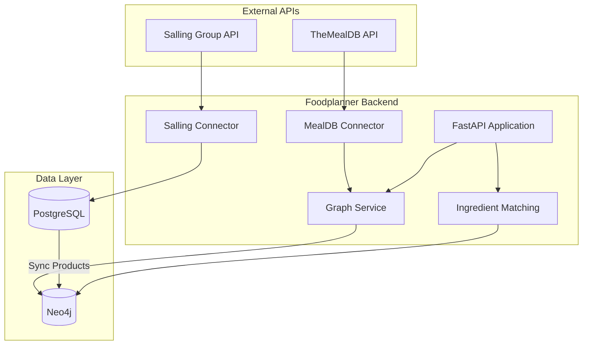
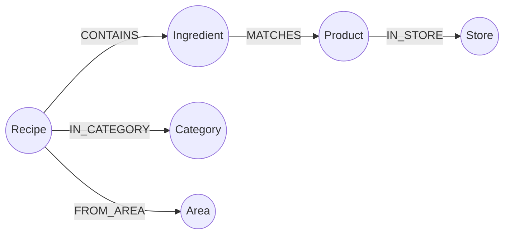

# Neo4j Recipe Knowledge Graph Implementation

## Architecture Overview



## Knowledge Graph Schema



**Node Types:**

| Node | Key Properties | Source |
|------|----------------|--------|
| Recipe | id, name, instructions, thumbnail, source_url | TheMealDB |
| Ingredient | id, name, normalized_name | TheMealDB |
| Product | id, name, price, ean, discount_price | Salling API (via PostgreSQL) |
| Category | name | TheMealDB |
| Area | name (cuisine/region) | TheMealDB |
| Store | id, name, brand | Salling API |

**Relationship Types:**

| Relationship | Properties |
|--------------|------------|
| CONTAINS | quantity, measure |
| MATCHES | confidence_score, match_type |
| IN_CATEGORY | - |
| FROM_AREA | - |
| IN_STORE | - |

## Implementation Steps

### 1. Infrastructure Setup

Add Neo4j to `docker-compose.yml`:

```yaml
neo4j:
  image: neo4j:5-community
  container_name: foodplanner-neo4j
  environment:
    NEO4J_AUTH: neo4j/foodplanner_dev
    NEO4J_PLUGINS: '["apoc"]'
  ports:
    - "7474:7474"  # Browser
    - "7687:7687"  # Bolt
  volumes:
    - neo4j_data:/data
```

Add Python dependencies to `pyproject.toml`:
- `neo4j>=5.0` (official async driver)

### 2. TheMealDB Connector

Create [`src/foodplanner/ingest/connectors/mealdb.py`](src/foodplanner/ingest/connectors/mealdb.py):

- Implement `StoreConnector`-like interface for consistency
- Endpoints to use:
  - `/categories.php` - fetch all categories
  - `/list.php?a=list` - fetch all areas/cuisines
  - `/list.php?i=list` - fetch all ingredients
  - `/search.php?f={letter}` - fetch meals A-Z (iterate all letters)
  - `/lookup.php?i={id}` - fetch full meal details
- Test API key: `1` (base URL: `https://www.themealdb.com/api/json/v1/1/`)
- Handle the 20 ingredient/measure fields per meal (strIngredient1-20, strMeasure1-20)

### 3. Graph Database Module

Create [`src/foodplanner/graph/`](src/foodplanner/graph/) package:

```
src/foodplanner/graph/
├── __init__.py
├── database.py      # Neo4j connection management
├── models.py        # Pydantic models for graph nodes
├── repository.py    # CRUD operations with Cypher queries
└── service.py       # Business logic layer
```

Key Cypher patterns for `repository.py`:

```cypher
// Create recipe with ingredients
MERGE (r:Recipe {id: $recipe_id})
SET r.name = $name, r.instructions = $instructions, ...
WITH r
UNWIND $ingredients AS ing
MERGE (i:Ingredient {name: ing.name})
MERGE (r)-[:CONTAINS {quantity: ing.quantity, measure: ing.measure}]->(i)

// Find recipes by available discounted products
MATCH (p:Product)-[:HAS_DISCOUNT]->(d:Discount)
WHERE d.valid_to >= date()
MATCH (i:Ingredient)-[m:MATCHES]->(p)
WHERE m.confidence_score > 0.7
MATCH (r:Recipe)-[:CONTAINS]->(i)
RETURN r, collect(DISTINCT i) as discounted_ingredients
ORDER BY size(discounted_ingredients) DESC
```

### 4. Ingredient-to-Product Matching

Create [`src/foodplanner/graph/matching.py`](src/foodplanner/graph/matching.py):

Matching strategy (in order of confidence):
1. **Exact match** (confidence: 1.0) - normalized names match exactly
2. **Fuzzy match** (confidence: 0.7-0.9) - using `rapidfuzz` library
3. **Semantic match** (confidence: 0.5-0.8) - LLM-assisted for ambiguous cases

Normalization rules:
- Lowercase, strip whitespace
- Remove common suffixes: "fresh", "chopped", "diced", etc.
- Map ingredient synonyms: "capsicum" -> "pepper", etc.
- Handle Danish/English translations for Salling products

### 5. Data Ingestion Tasks

Create [`src/foodplanner/tasks/graph_ingestion.py`](src/foodplanner/tasks/graph_ingestion.py):

Celery tasks for:
- `ingest_mealdb_recipes` - Full sync of TheMealDB (run once, then periodic updates)
- `sync_products_to_graph` - Sync PostgreSQL products to Neo4j (after Salling ingestion)
- `compute_ingredient_matches` - Run matching algorithm on new products/ingredients

### 6. API Endpoints

Add to [`src/foodplanner/routers/recipes.py`](src/foodplanner/routers/recipes.py):

```python
GET  /recipes                    # List recipes (with filters)
GET  /recipes/{id}               # Get recipe with ingredients
GET  /recipes/by-ingredient      # Find recipes containing ingredient
GET  /recipes/by-discounts       # Recipes optimized for current discounts
GET  /ingredients                # List all ingredients
GET  /ingredients/{id}/products  # Get matching products for ingredient
```

## File Changes Summary

| File | Action |
|------|--------|
| `docker-compose.yml` | Add Neo4j service |
| `pyproject.toml` | Add neo4j, rapidfuzz dependencies |
| `src/foodplanner/config.py` (new) | Add Neo4j connection settings |
| `src/foodplanner/ingest/connectors/mealdb.py` (new) | TheMealDB API connector |
| `src/foodplanner/graph/__init__.py` (new) | Graph module |
| `src/foodplanner/graph/database.py` (new) | Neo4j connection |
| `src/foodplanner/graph/models.py` (new) | Graph node models |
| `src/foodplanner/graph/repository.py` (new) | Cypher queries |
| `src/foodplanner/graph/service.py` (new) | Graph service |
| `src/foodplanner/graph/matching.py` (new) | Ingredient matching |
| `src/foodplanner/tasks/graph_ingestion.py` (new) | Celery tasks |
| `src/foodplanner/routers/recipes.py` (new) | Recipe API endpoints |
| `src/foodplanner/main.py` | Register new router |

## Testing Strategy

1. **Unit tests** - Mock Neo4j driver, test Cypher query construction
2. **Integration tests** - Use Neo4j testcontainers for actual graph queries
3. **Connector tests** - Mock TheMealDB responses (fixtures in `tests/fixtures/mealdb/`)
