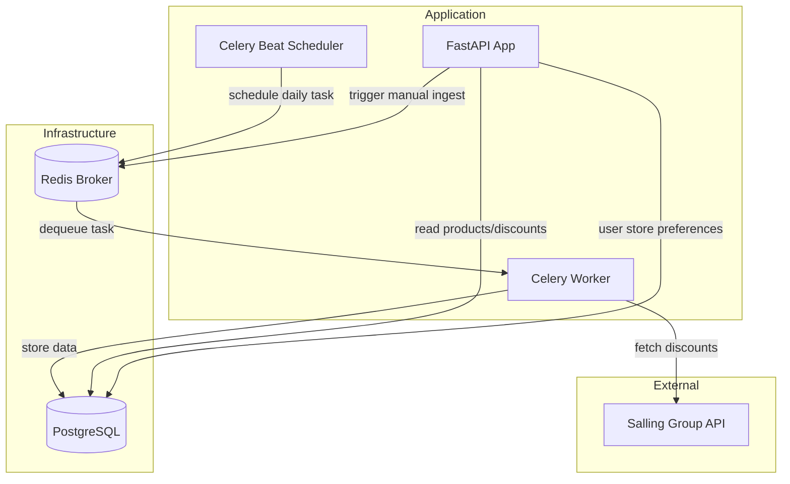
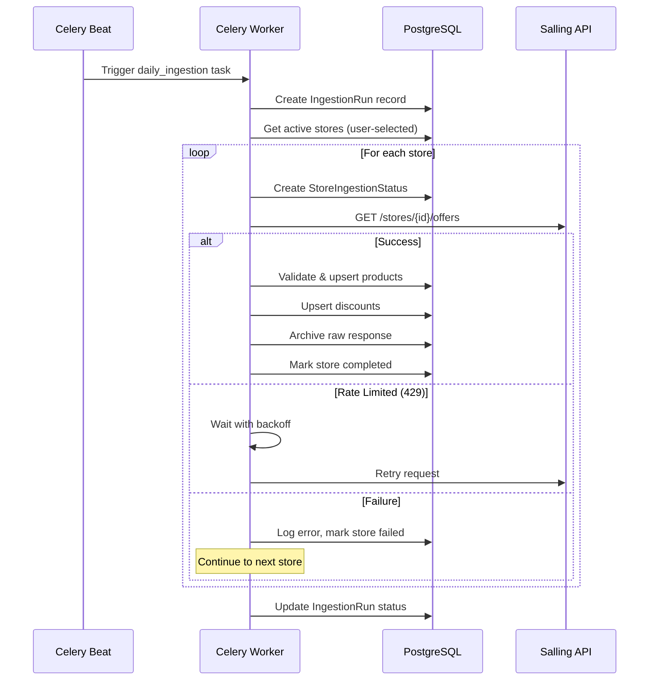

# Robust Ingestion Pipeline

## Architecture Overview



## Component Breakdown

### 1. Celery Infrastructure Setup

Add Celery with Redis broker to handle background task scheduling.

**New files:**

- `src/foodplanner/celery_app.py` - Celery application configuration
- `src/foodplanner/tasks/` - Task modules directory
- `src/foodplanner/tasks/ingestion.py` - Ingestion task definitions

**Key configuration:**

- Redis as message broker (add to `docker-compose.yml`)
- Celery Beat for periodic scheduling (daily at 2:00 AM)
- Task retry policy with exponential backoff
- Result backend in PostgreSQL for task tracking

**Dependencies to add:**

```
celery[redis]>=5.3.0
```

### 2. Store Discovery and User Selection

Enable users to discover and select their preferred stores.

**Database changes** - Add to [models.py](src/foodplanner/models.py):

- `UserStorePreference` model (user_id, store_id, priority)
- Update `Store` model with `is_active`, `region`, `zip_code` fields

**New API endpoints:**

- `GET /api/v1/stores/discover?zip={zip}&radius={km}` - Find stores near location
- `GET /api/v1/users/{user_id}/stores` - Get user's selected stores
- `POST /api/v1/users/{user_id}/stores` - Add store to user's preferences
- `DELETE /api/v1/users/{user_id}/stores/{store_id}` - Remove store

**Connector enhancement** - Add to [salling.py](src/foodplanner/ingest/connectors/salling.py):

```python
async def get_stores(self, zip_code: str | None = None) -> list[dict]:
    """Fetch all stores, optionally filtered by zip code."""
```

### 3. Robust Ingestion Pipeline

Enhance [batch_ingest.py](src/foodplanner/ingest/batch_ingest.py) with production-grade resilience.

**Error handling strategy:**

- Per-store error isolation (one store failure doesn't stop others)
- Exponential backoff: 1s, 2s, 4s, 8s, max 3 retries per API call
- Rate limit detection (HTTP 429) with automatic pause
- Circuit breaker pattern for repeated failures

**Data validation** - New file `src/foodplanner/ingest/schemas.py`:

```python
class SallingOfferResponse(BaseModel):
    product: ProductInfo
    original_price: float
    offer_price: float
    valid_from: date
    valid_to: date
    # Validates API responses before DB insertion
```

**Raw data archiving** - New model `RawIngestionData`:

- Store raw JSON responses with timestamp
- Enable replay of historical ingestion
- Auto-cleanup after 30 days

### 4. Enhanced Tracking and Logging

Extend the current `IngestionRun` model for granular tracking.

**New model** `StoreIngestionStatus`:

```python
class StoreIngestionStatus(Base):
    __tablename__ = "store_ingestion_status"

    id: Mapped[int]
    run_id: Mapped[int]  # FK to IngestionRun
    store_id: Mapped[str]
    status: Mapped[str]  # pending, running, completed, failed
    products_fetched: Mapped[int]
    discounts_fetched: Mapped[int]
    error_message: Mapped[str | None]
    retry_count: Mapped[int]
    started_at: Mapped[datetime]
    completed_at: Mapped[datetime | None]
```

**Structured logging** - New file `src/foodplanner/logging_config.py`:

- JSON-formatted logs for production
- Context injection (run_id, store_id, task_id)
- Log levels per module configuration

### 5. API Endpoints for Pipeline Management

**New router** `src/foodplanner/routers/ingestion.py`:

- `POST /api/v1/ingestion/trigger` - Manually trigger ingestion
- `GET /api/v1/ingestion/runs` - List recent runs with pagination
- `GET /api/v1/ingestion/runs/{run_id}` - Get run details with per-store status
- `GET /api/v1/ingestion/health` - Pipeline health check

### 6. Docker Compose Updates

Add services to [docker-compose.yml](docker-compose.yml):

```yaml
redis:
  image: redis:7-alpine
  ports:
    - "6379:6379"

celery-worker:
  build: .
  command: celery -A foodplanner.celery_app worker --loglevel=info
  depends_on:
    - redis
    - db

celery-beat:
  build: .
  command: celery -A foodplanner.celery_app beat --loglevel=info
  depends_on:
    - redis
```

## Data Flow



## File Structure After Implementation

```
src/foodplanner/
├── celery_app.py              # NEW: Celery configuration
├── logging_config.py          # NEW: Structured logging setup
├── tasks/
│   ├── __init__.py            # NEW
│   └── ingestion.py           # NEW: Celery task definitions
├── ingest/
│   ├── batch_ingest.py        # MODIFIED: Core logic, called by task
│   ├── schemas.py             # NEW: Pydantic validation schemas
│   └── connectors/
│       ├── base.py            # MODIFIED: Add get_stores method
│       └── salling.py         # MODIFIED: Add get_stores, retry logic
├── routers/
│   ├── __init__.py            # NEW
│   ├── stores.py              # NEW: Store discovery/selection
│   └── ingestion.py           # NEW: Pipeline management
└── models.py                  # MODIFIED: New models
```

## Implementation Order

The tasks are ordered to build incrementally, with each phase providing testable functionality.
