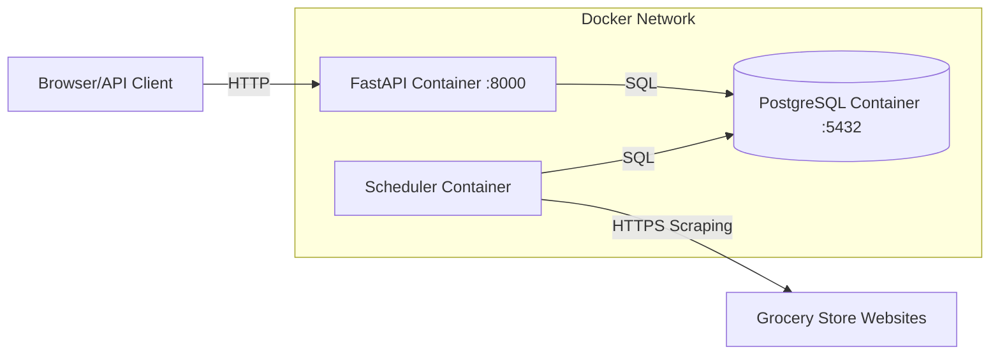

# Docker Setup Guide

This guide explains how to run Foodplanner using Docker for a reproducible development environment.

## Quick Reference

**Status**: Verified working as of 2026-01-24

| Service | Container | Port | Status |
|---------|-----------|------|--------|
| PostgreSQL 16 | foodplanner-db | 5432 | Healthy |
| FastAPI API | foodplanner-api | 8000 | Healthy |
| Scheduler | foodplanner-scheduler | - | Running |

**Quick Commands**:
```bash
# Build images
docker-compose build

# Start all services
docker-compose up -d

# Check status
docker ps

# Test API health
curl http://localhost:8000/health
# Returns: {"status": "ok"}

# View logs
docker-compose logs -f

# Stop services
docker-compose down
```

## Overview

The Docker setup includes:

- **PostgreSQL 16**: Database for storing products, discounts, users, and meal plans
- **FastAPI Backend**: Python web server with hot reload for development
- **Scheduler**: Background service that runs daily product data scraping
- **pgAdmin** (optional): Web UI for database management

## Architecture



## Services

### 1. PostgreSQL (`postgres`)

**Purpose**: Primary data store

**Access**:
- Host: `localhost:5432` (from host machine)
- Host: `postgres:5432` (from other containers)
- User: `foodplanner` (configurable via `POSTGRES_USER`)
- Password: set via `POSTGRES_PASSWORD` in `.env`
- Database: `foodplanner` (configurable via `POSTGRES_DB`)

**Data persistence**: Stored in Docker volume `postgres_data`

### 2. FastAPI API (`api`)

**Purpose**: REST API for meal planning

**Access**:
- API: http://localhost:8000
- API Docs: http://localhost:8000/docs
- Health: http://localhost:8000/health

**Features**:
- Hot reload enabled (code changes auto-reload)
- Source code mounted from `./src`
- Uses async PostgreSQL driver (`asyncpg`)

### 3. Scheduler (`scheduler`)

**Purpose**: Daily batch product data scraping

**Behavior**:
- Runs `batch_ingest.py` every 24 hours
- Logs to stdout (view with `docker-compose logs scheduler`)
- Uses sync PostgreSQL driver (`psycopg2`)

**Manual trigger**:
```bash
docker-compose exec scheduler python -m foodplanner.ingest.batch_ingest
```

### 4. pgAdmin (`pgadmin`) [Optional]

**Purpose**: Database management UI

**Access**: http://localhost:5050
- Email: configurable via `PGADMIN_EMAIL` in `.env`
- Password: set via `PGADMIN_PASSWORD` in `.env`

**Start with**:
```bash
docker-compose --profile tools up -d
```

## Common Operations

### Starting Services

```bash
# Start in background
docker-compose up -d

# Start with logs visible
docker-compose up

# Start specific services only
docker-compose up api postgres
```

### Viewing Logs

```bash
# All services
docker-compose logs -f

# Specific service
docker-compose logs -f api
docker-compose logs -f scheduler

# Last 100 lines
docker-compose logs --tail=100 api
```

### Accessing Containers

```bash
# Shell in API container
docker-compose exec api /bin/bash

# Run Python command
docker-compose exec api python -c "print('Hello from container')"

# Database shell
docker-compose exec postgres psql -U foodplanner -d foodplanner
```

### Running Tests

```bash
# Run all tests
docker-compose exec api pytest

# With coverage
docker-compose exec api pytest --cov=foodplanner --cov-report=html

# Specific test file
docker-compose exec api pytest tests/test_schemas.py
```

### Linting

```bash
# Check for issues
docker-compose exec api ruff check .

# Auto-fix
docker-compose exec api ruff check --fix .
```

### Stopping Services

```bash
# Stop but keep containers
docker-compose stop

# Stop and remove containers
docker-compose down

# Stop and remove containers + volumes (deletes data!)
docker-compose down -v
```

## Development Workflow

### Hot Reload

The API container has hot reload enabled. Just edit files in `src/` and the server will automatically restart:

1. Edit `src/foodplanner/main.py`
2. Watch logs: `docker-compose logs -f api`
3. See reload message
4. Test changes: http://localhost:8000

### Database Changes

When you modify database models:

1. Update `src/foodplanner/models.py`
2. Create migration (when Alembic is set up):
   ```bash
   docker-compose exec api alembic revision --autogenerate -m "Add new field"
   ```
3. Apply migration:
   ```bash
   docker-compose exec api alembic upgrade head
   ```

### Adding Dependencies

1. Edit `pyproject.toml` to add new package
2. Rebuild image:
   ```bash
   docker-compose build api
   docker-compose up -d api
   ```

## Troubleshooting

### Port Already in Use

If port 8000 or 5432 is already in use:

**Option 1**: Change port in `docker-compose.yml`:
```yaml
ports:
  - "8001:8000"  # Use 8001 on host
```

**Option 2**: Stop conflicting service

### Container Won't Start

Check logs:
```bash
docker-compose logs api
```

Common issues:
- Database not ready: Wait for health check to pass
- Missing env vars: Check `.env` file exists
- Build errors: Run `docker-compose build --no-cache`

### Database Connection Issues

Verify database is running:
```bash
docker-compose ps postgres
```

Check health:
```bash
docker-compose exec postgres pg_isready -U foodplanner
```

### Can't Access API

1. Check API is running: `docker-compose ps api`
2. Check logs: `docker-compose logs api`
3. Verify health: `curl http://localhost:8000/health`

### Reset Everything

```bash
# Nuclear option: delete everything and start fresh
docker-compose down -v
docker-compose build --no-cache
docker-compose up -d
```

## Production Considerations

The current `docker-compose.yml` is optimized for development. For production:

### Security

- [x] All passwords read from environment / `.env` (no hardcoded defaults)
- [ ] Use secrets management (Docker secrets, Vault)
- [ ] Remove debug/reload flags
- [ ] Enable HTTPS
- [x] CORS restricted to explicit methods and headers

### Scheduler

Replace simple loop with proper scheduler:

**Option 1: Cron**
```dockerfile
# Add to Dockerfile
RUN apt-get install -y cron
COPY crontab /etc/cron.d/ingestion
CMD cron && tail -f /var/log/cron.log
```

**Option 2: Celery Beat**
```python
# Use Celery for distributed task scheduling
# Add Redis/RabbitMQ to docker-compose
```

### Scaling

Add load balancer and run multiple API replicas:

```yaml
api:
  # ...
  deploy:
    replicas: 3
```

### Monitoring

Add monitoring stack:

```yaml
prometheus:
  image: prom/prometheus
  # ...

grafana:
  image: grafana/grafana
  # ...
```

### Backups

Automated database backups:

```yaml
backup:
  image: prodrigestivill/postgres-backup-local
  environment:
    POSTGRES_HOST: postgres
    POSTGRES_DB: foodplanner
    SCHEDULE: "@daily"
  volumes:
    - ./backups:/backups
```

## Environment Variables

All services read from `.env` file in project root.  Copy `.env.example` to
`.env` and fill in the required values:

```bash
cp .env.example .env
# Then edit .env and set your passwords
```

See `.env.example` for the full list of variables.

**Important**: Never commit `.env` to version control!

## Docker Compose Profiles

Use profiles to start optional services:

```bash
# Default: postgres + api + scheduler
docker-compose up -d

# With pgAdmin
docker-compose --profile tools up -d

# Only database (for local dev)
docker-compose up -d postgres
```

## Next Steps

- Set up CI/CD to build and push images
- Add health checks to all services
- Implement proper migrations with Alembic
- Add monitoring and alerting
- Configure log aggregation
- Set up automated backups
