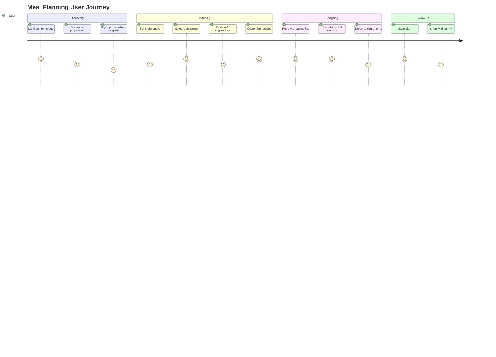

# Frontend UX Flows

## Overview

The Foodplanner frontend is a web application focused on making meal planning simple, cost-effective, and personalized. The core flow guides users through building a meal plan, reviewing discounts, and generating a shopping list.

## User Journey Map



## Page Flows

### 1. Home / Landing Page

**Goal**: Communicate value and convert to signup

**Elements**:
- Hero section: "Plan meals around local discounts"
- Value props: Save money, eat healthy, reduce waste
- Quick stats: "Users save avg 30% on groceries"
- CTA: "Start Planning" button
- Sample meal plan preview

**User Actions**:
- Click "Start Planning" → Goes to onboarding or meal builder if logged in
- Click "How it works" → Scrolls to explanation section
- Click "Sign Up" → Goes to registration

---

### 2. Onboarding Flow (First-Time Users)

**Goal**: Collect preferences to personalize plans

**Step 1: People & Dates**
- Number of people (default: 2, range 1-20)
- Date range picker (default: next 7 days)
- Meal types: Breakfast, Lunch, Dinner (checkboxes)

**Step 2: Dietary Preferences**
- Common presets: Vegetarian, Vegan, Gluten-Free, Dairy-Free
- Custom allergies (text input with autocomplete)
- Cuisine preferences: Italian, Asian, Nordic, etc.

**Step 3: Stores**
- Location input (address or allow GPS)
- Show nearby Netto & Rema 1000 stores
- Select preferred stores (multi-select)

**Step 4: Budget (Optional)**
- Max budget per week (optional slider)
- Preference for discounts: "Prioritize savings" vs "Prioritize variety"

**Navigation**:
- "Next" / "Back" buttons
- Progress indicator (4 steps)
- "Skip" option for optional steps
- "Generate Plan" at end → Goes to meal plan builder

---

### 3. Meal Plan Builder (Main Interface)

**Layout**:

```
┌─────────────────────────────────────────────────────────┐
│ Topbar: Logo | User Menu | Save | Share                │
├─────────────────────────────────────────────────────────┤
│                                                         │
│ Sidebar (Left)              Main Content               │
│ ┌─────────────────┐        ┌──────────────────────┐   │
│ │ Filters         │        │ Weekly Calendar      │   │
│ │ - Preferences   │        │                      │   │
│ │ - Budget        │        │ Mon | Tue | Wed ...  │   │
│ │ - Stores        │        │ ☰ Breakfast          │   │
│ │                 │        │ ☰ Lunch              │   │
│ │ Discounts       │        │ ☰ Dinner             │   │
│ │ - Produce       │        │                      │   │
│ │ - Dairy         │        │ (Recipe cards)       │   │
│ │ - Protein       │        └──────────────────────┘   │
│ │                 │                                    │
│ │ [Regenerate]    │        Recipe Suggestions         │
│ └─────────────────┘        (AI-powered cards)         │
│                                                         │
│                            Right Sidebar               │
│                            ┌─────────────────────┐    │
│                            │ Shopping List       │    │
│                            │ Total: 450 kr       │    │
│                            │ Savings: 85 kr      │    │
│                            │                     │    │
│                            │ (Grouped items)     │    │
│                            │                     │    │
│                            │ [Export to Cart]    │    │
│                            └─────────────────────┘    │
└─────────────────────────────────────────────────────────┘
```

**Key Features**:

#### Calendar View
- Grid layout: Days × Meal types
- Drag-and-drop recipes from suggestions
- Hover to see recipe details
- Click to edit or swap
- Empty slots show "Add meal" prompt

#### Recipe Cards
- Image (if available)
- Recipe name & servings
- Key tags: "Quick", "Healthy", "Uses discounts"
- Discount indicator: "Save 25 kr with current offers"
- Cost per serving
- Click to expand full details

#### Discounts Panel (Sidebar)
- Grouped by category
- Show product name, original price, discount price
- Highlight which recipes use this product
- Filter: "Only show used in plan" toggle

#### Shopping List (Right Sidebar)
- Auto-generated from selected recipes
- Grouped by store and category
- Show quantities aggregated across recipes
- Checkboxes to manually remove items (if on-hand)
- Export options: Print, Email, Add to cart

**Interactions**:

1. **Adding a Recipe**:
   - User drags recipe card to calendar slot
   - OR clicks "Add to [Day][Meal]" button on card
   - Shopping list updates in real-time
   - Cost recalculates

2. **Swapping a Recipe**:
   - Click recipe in calendar
   - Modal shows: "Find alternatives"
   - Filters: Similar cost, same category, uses same discounts
   - Select replacement → Updates plan

3. **Regenerating Suggestions**:
   - Click "Regenerate" in sidebar
   - AI generates new recipe suggestions based on unused discounts
   - Previous suggestions fade out, new ones fade in

4. **Manual Recipe Search**:
   - Search bar at top of suggestions
   - Type ingredient or dish name
   - Filters recipes by query + user preferences

---

### 4. Recipe Detail Modal

**Triggered by**: Clicking a recipe card

**Content**:
- Full-size image
- Name, description, servings
- Nutrition facts (calories, protein, carbs, fat)
- Ingredients list with:
  - Quantities
  - Availability in selected stores
  - Discount status (highlight in green if discounted)
- Step-by-step instructions
- Tags: Difficulty, prep time, cook time

**Actions**:
- "Add to Plan" dropdown (select day/meal)
- "Save to Favorites"
- "Share" (copy link)
- Close (X button)

---

### 5. Shopping List Export Flow

**Option A: Print/PDF**
- Click "Print"
- Opens printable view:
  - Grouped by store
  - Checkboxes for paper list
  - Total cost at bottom
- User prints or saves as PDF

**Option B: Add to Cart (API Dependent)**
- Click "Export to Cart"
- Select store (if multiple)
- Modal: "Connecting to [Store] cart..."
- If supported by API:
  - Items added to online cart
  - Redirect to store checkout
- If NOT supported:
  - Show message: "Cart API not available for this store"
  - Offer alternative: "Copy list to clipboard"

**Option C: Email**
- Click "Email"
- Enter email address
- Send formatted shopping list

---

### 6. User Account / Settings

**Profile**:
- Email, password change
- Saved preferences (dietary, stores, budget)
- Delete account

**Meal Plans**:
- History of past plans
- Click to view or duplicate
- Archive old plans

**Pantry (Future)**:
- Add items on-hand
- Plans will account for these and skip buying them

**Notifications**:
- Weekly discount alerts
- New recipe suggestions
- Plan reminders

---

## Mobile Responsive Considerations

### Mobile Layout Changes

- **Sidebar → Bottom Sheet**: Discounts and shopping list become bottom sheets (swipe up)
- **Calendar → List View**: Day-by-day scrolling instead of grid
- **Recipe Cards → Smaller**: Image on left, details on right (horizontal layout)
- **Drag-and-Drop → Tap to Add**: Use action buttons instead of drag

### Mobile-First Interactions

- Swipe gestures: Left to remove, right to add alternative
- Bottom navigation: Plan | Discounts | List | Profile
- Quick add: "+" floating action button

---

## Visual Design Principles

### Color Scheme

- **Primary**: Green (savings, healthy, fresh)
- **Secondary**: Orange (discounts, deals)
- **Neutral**: Grays for text and backgrounds
- **Semantic**: Red for allergens, green for discounted items

### Typography

- Headers: Clean sans-serif (e.g., Inter, Nunito)
- Body: Readable size (16px min on mobile)
- Emphasis: Bold for discounts and savings

### Imagery

- High-quality food photos for recipes
- Icons for categories (vegetables, meat, dairy)
- Illustrations for empty states

---

## Accessibility

- WCAG 2.1 AA compliance
- Keyboard navigation for all interactions
- Screen reader labels for interactive elements
- High contrast mode support
- Focus indicators on all focusable elements

---

## Performance Goals

- First Contentful Paint < 1.5s
- Time to Interactive < 3s
- Smooth drag-and-drop (60 FPS)
- Optimistic UI updates (don't wait for API)

---

## Future Enhancements

### Social Features
- Share meal plans with friends
- Family accounts (multiple users, shared plan)
- Community recipes (user-submitted)

### Advanced Planning
- Multi-week planning
- Leftover tracking
- Meal prep mode (batch cooking suggestions)

### Gamification
- Savings streak
- Badges for trying new recipes
- Carbon footprint reduction tracking

---

## Technical Stack Recommendations

### Framework Options

1. **Next.js + React** (Recommended)
   - Server-side rendering for SEO
   - Great TypeScript support
   - Easy API routes integration

2. **Vue + Nuxt**
   - Simpler learning curve
   - Good performance

3. **SvelteKit**
   - Lightest bundle size
   - Excellent performance

### State Management

- **Zustand** or **Redux Toolkit**: For global state (user, plan, cart)
- **React Query**: For server state (API calls, caching)

### UI Components

- **Tailwind CSS**: For utility-first styling
- **shadcn/ui** or **Radix UI**: For accessible components
- **react-beautiful-dnd**: For drag-and-drop

### Build & Deploy

- **Vercel** or **Netlify**: For hosting
- **GitHub Actions**: For CI/CD
- **Lighthouse CI**: For performance monitoring

---

## API Endpoints Needed

Frontend will consume these FastAPI endpoints:

```
POST   /api/v1/meal-plans          - Generate new meal plan
GET    /api/v1/meal-plans/:id      - Get plan by ID
PATCH  /api/v1/meal-plans/:id      - Update plan
DELETE /api/v1/meal-plans/:id      - Delete plan

GET    /api/v1/recipes             - Search recipes
GET    /api/v1/recipes/:id         - Get recipe details

GET    /api/v1/discounts           - Get current discounts
GET    /api/v1/stores              - Get stores near location

POST   /api/v1/users/register      - Sign up
POST   /api/v1/users/login         - Login
GET    /api/v1/users/me            - Get current user
PATCH  /api/v1/users/me            - Update preferences
```
