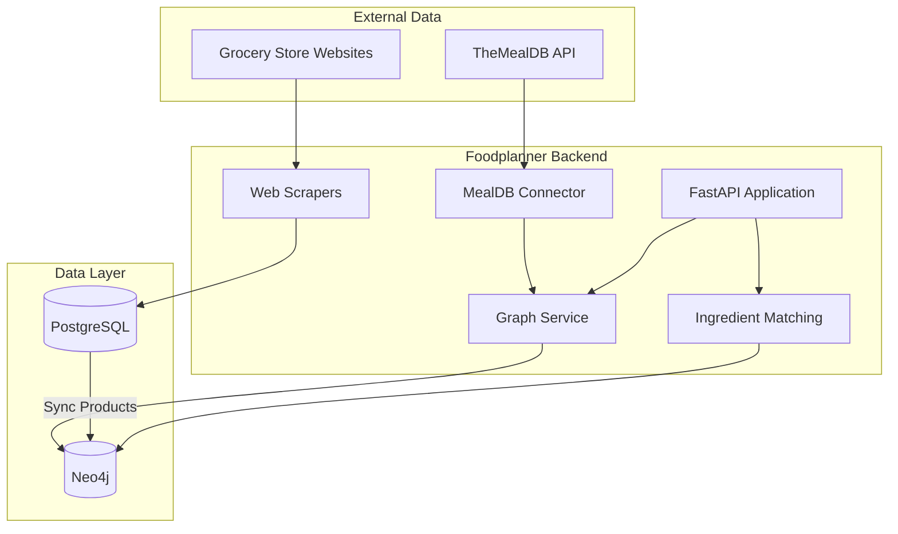
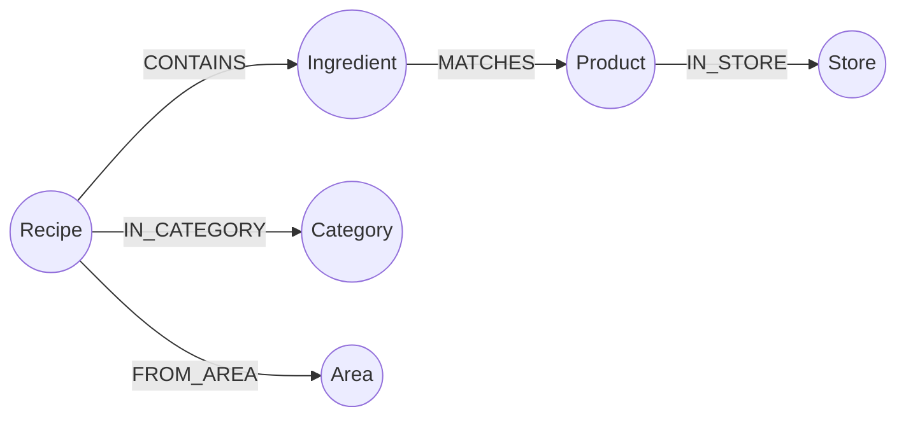

# Neo4j Recipe Knowledge Graph

This document describes the recipe knowledge graph implementation using Neo4j.

## Overview

The knowledge graph stores recipes from TheMealDB and matches their ingredients to products scraped from Danish grocery stores (REMA 1000, etc.). This enables:

- Recipe discovery and search
- Ingredient-to-product matching
- Discount-aware meal planning
- Cost estimation for recipes

## Architecture



## Knowledge Graph Schema



### Node Types

| Node | Key Properties | Source |
|------|----------------|--------|
| Recipe | id, name, instructions, thumbnail, source_url | TheMealDB |
| Ingredient | name, normalized_name | TheMealDB |
| Product | id, name, price, ean, discount_price | Web scraping (via PostgreSQL) |
| Category | name, description, thumbnail | TheMealDB |
| Area | name (cuisine/region) | TheMealDB |
| Store | id, name, brand | Web scraping |

### Relationship Types

| Relationship | Properties |
|--------------|------------|
| CONTAINS | quantity, measure |
| MATCHES | confidence_score, match_type, matched_at |
| IN_CATEGORY | - |
| FROM_AREA | - |
| IN_STORE | - |

## Components

### TheMealDB Connector

Location: `src/foodplanner/ingest/connectors/mealdb.py`

Fetches recipes from TheMealDB API using the test key (`1`). Endpoints used:

- `/categories.php` - All recipe categories
- `/list.php?a=list` - All cuisine areas
- `/list.php?i=list` - All ingredients
- `/search.php?f={letter}` - Recipes by first letter (A-Z)
- `/lookup.php?i={id}` - Full recipe details

### Graph Module

Location: `src/foodplanner/graph/`

| File | Purpose |
|------|---------|
| `database.py` | Neo4j connection management |
| `models.py` | Pydantic models for nodes and relationships |
| `repository.py` | Cypher queries for CRUD operations |
| `service.py` | Business logic layer |
| `matching.py` | Ingredient-to-product matching |

### Ingredient Matching

The matching algorithm uses multiple strategies:

1. **Exact match** (confidence: 1.0) - Normalized names match exactly
2. **Synonym match** (confidence: 0.95) - Using ingredient synonyms (e.g., "capsicum" = "bell pepper")
3. **Fuzzy match** (confidence: 0.5-0.9) - Using rapidfuzz for similar strings
4. **Danish translation** - Maps English ingredients to Danish product names

Normalization rules:
- Lowercase, strip whitespace
- Remove common modifiers: "fresh", "chopped", "diced", etc.
- Remove measurements: "2 cups", "500g", etc.
- Remove parenthetical notes: "(softened)", "(room temperature)"

### Celery Tasks

Location: `src/foodplanner/tasks/graph_ingestion.py`

| Task | Schedule | Purpose |
|------|----------|---------|
| `ingest_mealdb_recipes_task` | Weekly (Sunday 4:00 AM) | Fetch all recipes from MealDB |
| `sync_products_to_graph_task` | Daily (3:00 AM) | Sync products from PostgreSQL |
| `compute_ingredient_matches_task` | On-demand | Run ingredient matching |
| `full_graph_refresh_task` | On-demand | Complete refresh (all three tasks) |

## API Endpoints

All endpoints are prefixed with `/api/v1/`.

### Recipes

| Endpoint | Method | Description |
|----------|--------|-------------|
| `/recipes` | GET | List/search recipes with filters |
| `/recipes/{id}` | GET | Get recipe with ingredients |
| `/recipes/{id}/cost` | GET | Estimate recipe cost |
| `/recipes/by-discounts` | GET | Recipes using discounted products |
| `/recipes/{id}` | DELETE | Delete a recipe |

### Ingredients

| Endpoint | Method | Description |
|----------|--------|-------------|
| `/ingredients` | GET | List all ingredients |
| `/ingredients/unmatched` | GET | Ingredients without product matches |
| `/ingredients/{name}/products` | GET | Get matched products for ingredient |
| `/ingredients/match` | POST | Live ingredient matching |

### Metadata

| Endpoint | Method | Description |
|----------|--------|-------------|
| `/categories` | GET | List all recipe categories |
| `/areas` | GET | List all cuisine areas |

### Graph Management

| Endpoint | Method | Description |
|----------|--------|-------------|
| `/graph/stats` | GET | Graph database statistics |
| `/graph/ingest/mealdb` | POST | Trigger MealDB ingestion |
| `/graph/sync/products` | POST | Trigger product sync |
| `/graph/compute-matches` | POST | Trigger ingredient matching |
| `/graph/refresh` | POST | Full graph refresh |

## Configuration

Environment variables (set in `.env` or docker-compose):

```bash
# Neo4j
NEO4J_URI=bolt://localhost:7687
NEO4J_USER=neo4j
NEO4J_PASSWORD=foodplanner_dev

# TheMealDB
MEALDB_API_KEY=1  # Test key for development
```

## Getting Started

### 1. Start Services

```bash
docker-compose up -d
```

This starts PostgreSQL, Redis, Neo4j, and the API.

### 2. Initialize the Graph

Trigger a full graph refresh via API:

```bash
curl -X POST http://localhost:8000/api/v1/graph/refresh
```

Or run tasks individually:

```bash
# Import recipes from MealDB
curl -X POST http://localhost:8000/api/v1/graph/ingest/mealdb

# Sync products (after scraping ingestion)
curl -X POST http://localhost:8000/api/v1/graph/sync/products

# Compute ingredient matches
curl -X POST http://localhost:8000/api/v1/graph/compute-matches
```

### 3. Access Neo4j Browser

Open http://localhost:7474 and login with `neo4j` / `foodplanner_dev`.

Example Cypher queries:

```cypher
// Count nodes
MATCH (n) RETURN labels(n)[0] as type, count(n) as count

// Find recipes with most discounted ingredients
MATCH (r:Recipe)-[:CONTAINS]->(i:Ingredient)-[:MATCHES]->(p:Product)
WHERE p.has_active_discount = true
RETURN r.name, count(DISTINCT i) as discounted
ORDER BY discounted DESC
LIMIT 10

// Find unmatched ingredients
MATCH (i:Ingredient)
WHERE NOT (i)-[:MATCHES]->(:Product)
RETURN i.name
LIMIT 20
```

## Testing

Run tests with:

```bash
uv run pytest tests/test_mealdb_connector.py tests/test_graph_models.py tests/test_ingredient_matching.py -v
```

## Future Enhancements

- [ ] Semantic matching using embeddings for better ingredient-product matching
- [ ] Recipe generation based on available discounted products
- [ ] User preference learning for personalized recipe recommendations
- [ ] Nutritional analysis and filtering
- [ ] Multi-language support for ingredients
