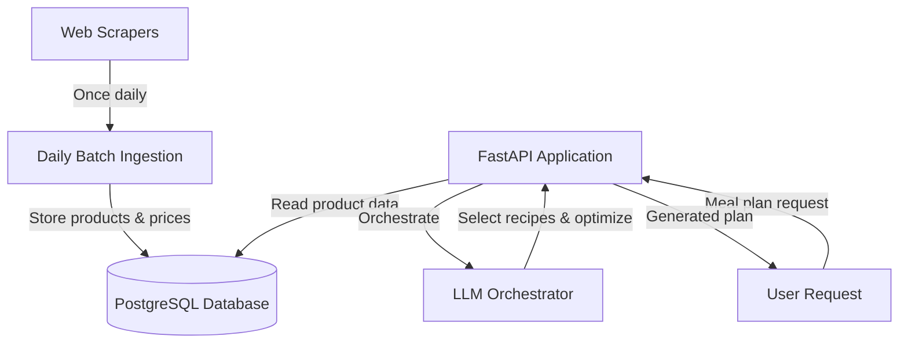

# Pipeline Architecture

## Overview

The Foodplanner pipeline is designed to generate meal plans based on grocery store discounts while maintaining determinism and reproducibility. The pipeline combines rule-based deterministic components with LLM orchestration for flexible decision-making.

## Data Flow



## Deterministic Components

### 1. Data Ingestion (Batch)

**Location**: `src/foodplanner/ingest/batch_ingest.py`

**Schedule**: Daily at 2:00 AM (configurable)

**Process**:
1. Check if ingestion already completed for today
2. Scrape product data from grocery store websites
3. Upsert stores, products, and prices to database
4. Log run status and metrics to `ingestion_runs` table

**Determinism Strategy**:
- Timestamped runs prevent duplicate ingestion
- All scraped data is cached in database with `last_updated` timestamps
- Failed runs are logged and can be retried
- Version control on data schemas

### 2. Product Matching

**Location**: `src/foodplanner/normalize/` (to be implemented)

**Inputs**:
- Recipe ingredient lists (strings)
- Product database (from DB)
- User location/store preferences

**Outputs**:
- Matched products with prices and discount status
- Confidence scores for matches

**Determinism Strategy**:
- Use fuzzy string matching with fixed thresholds
- Explicit mapping table for common ingredients → products
- Seed-based tie-breaking when multiple products match

### 3. Cost Optimization

**Location**: `src/foodplanner/plan/optimizer.py` (to be implemented)

**Inputs**:
- Candidate recipes
- Product prices (with discounts)
- Budget constraints
- User preferences

**Outputs**:
- Optimal recipe selection
- Shopping list with total cost

**Determinism Strategy**:
- Linear programming or rule-based scoring
- Fixed weights for discount preference vs nutrition
- Stable sorting for equal-cost options

## LLM Orchestration Boundaries

### What LLMs Do

**Location**: `src/foodplanner/orchestrator/` (to be implemented)

1. **User Intent Parsing**
   - Understand ambiguous meal preferences ("something healthy", "kid-friendly")
   - Extract dietary constraints from natural language
   - Clarify missing information

2. **Recipe Selection**
   - Generate or select recipes matching user preferences
   - Balance variety across the meal plan
   - Adapt recipes to available discounted ingredients

3. **Ingredient Substitution**
   - Suggest alternatives when preferred items are unavailable
   - Maintain recipe integrity while favoring discounts

4. **Shopping List Summarization**
   - Group items logically (produce, dairy, etc.)
   - Add helpful notes for users

### What LLMs Don't Do

- Direct web scraping or API calls
- Database queries or updates
- Price calculations or cost optimization
- Final decision on product selection (deterministic layer handles this)

### LLM Call Contract

**Input Schema**:
```python
{
    "task": "select_recipes | substitute_ingredient | parse_intent",
    "context": {
        "user_preferences": [...],
        "available_products": [...],
        "budget": float,
        "seed": int  # For reproducibility
    }
}
```

**Output Schema**:
```python
{
    "decision": str,
    "reasoning": str,
    "confidence": float,
    "alternatives": [...]
}
```

**Caching Strategy**:
- Cache LLM responses keyed by `(task, hash(context), model_version, seed)`
- Store in `llm_responses` table (to be created)
- TTL of 7 days for reproducibility during development

## Pipeline Execution Flow

### Request Phase

1. **User submits meal plan request** via API
   - Validated against `MealPlanRequest` schema
   - Assigned unique `request_id` for tracing

2. **LLM parses intent**
   - Expand ambiguous preferences
   - Validate completeness
   - Return structured request

3. **Database query phase** (deterministic)
   - Fetch all stores within user's area
   - Load products with active discounts
   - Load user's saved preferences and pantry items

### Planning Phase

4. **Recipe candidate generation** (LLM-assisted)
   - LLM suggests recipes based on preferences and discounts
   - Filter by dietary constraints (deterministic rules)
   - Score by nutrition, variety, discount alignment

5. **Product matching** (deterministic)
   - Match recipe ingredients to database products
   - Prefer discounted items when multiple options exist
   - Calculate cost for each recipe

6. **Optimization** (deterministic)
   - Select optimal recipe set within budget
   - Generate shopping list with quantities
   - Calculate total cost and savings

7. **Final review** (LLM-assisted)
   - LLM validates plan makes sense
   - Suggests improvements if needed
   - Returns to step 5 if necessary

### Response Phase

8. **Store to database**
   - Save `MealPlan` and associated recipes
   - Link to user account

9. **Return to user**
   - Format response with recipes, shopping list, cost breakdown

## Reproducibility

### Achieving Determinism

1. **Seed Control**: All random operations use explicit seeds
2. **Version Tracking**: Scraped data, model versions, and algorithm versions are logged
3. **Caching**: External calls (LLM) are cached with cache keys including all relevant context
4. **Stable Sorting**: When scores are equal, use secondary stable sort keys

### Replaying a Run

To reproduce a meal plan generation:

```python
from foodplanner.orchestrator import regenerate_plan

# Fetch original request context
original_request = get_meal_plan_request(plan_id)

# Replay with same seed and cached data
new_plan = regenerate_plan(
    request=original_request,
    seed=original_request.metadata["seed"],
    use_cache=True,
    cache_timestamp=original_request.created_at
)
```

### Logging

All pipeline executions log:
- Request ID and timestamp
- User preferences and constraints
- LLM prompts and responses (anonymized)
- Product prices at time of execution
- Selected recipes and reasoning
- Total cost and savings

Logs are queryable for debugging and auditing.

## Future Enhancements

- **Preference Learning**: Learn from user feedback to improve suggestions
- **Multi-week Planning**: Optimize across multiple weeks for better variety
- **Leftover Management**: Track partial package usage and plan around leftovers
- **Social Features**: Share meal plans with friends/family
